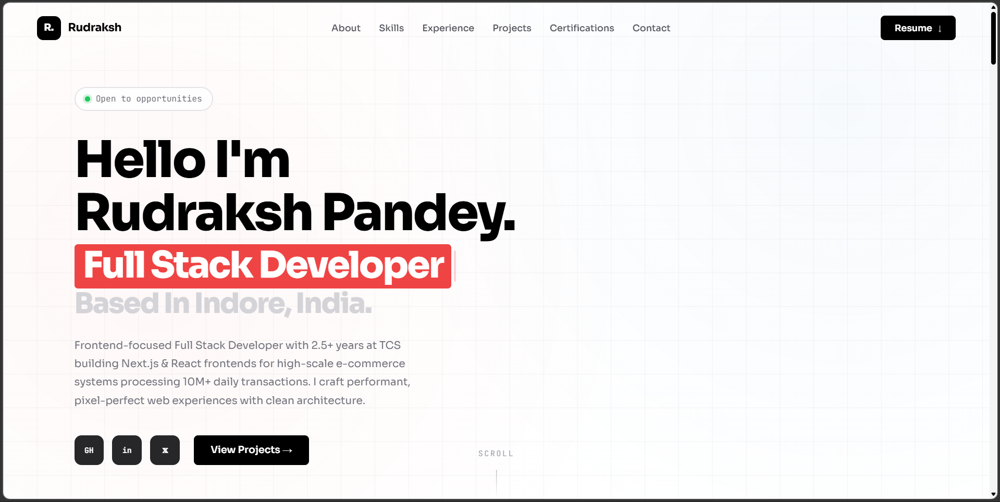

# Rudraksh Pandey — Portfolio v7

A fast, animated, fully responsive personal portfolio built with React and Vite. Features a custom cursor, scroll-reveal animations, a floating bottom nav for mobile/tablet, and a PDF resume modal — all with zero UI libraries.



---

## Tech Stack

| Layer | Technology |
|---|---|
| Framework | React 18 |
| Build Tool | Vite 5 |
| Animation | Framer Motion 11 |
| Styling | Vanilla CSS (CSS variables) |
| Icons | React Icons 5 |
| Language | JavaScript (ESM) |

---

## Project Structure

```
src/
├── components/
│   ├── App.jsx          # Root component, loader gate, cursor toggle
│   ├── Navbar.jsx       # Desktop pill nav + mobile floating bottom nav + resume modal
│   ├── Cursor.jsx       # Custom cursor (pointer:fine devices only)
│   ├── Loader.jsx       # Intro loading screen
│   ├── Reveal.jsx       # Scroll-reveal animation wrappers
│   └── Footer.jsx       # Footer
├── sections/
│   ├── Hero.jsx         # Landing — typewriter, floating illustration, parallax
│   ├── About.jsx        # About me
│   ├── Skills.jsx       # Skills grid with proficiency levels
│   ├── Experience.jsx   # Work experience timeline
│   ├── Projects.jsx     # Featured projects
│   ├── Certifications.jsx
│   └── Contact.jsx      # Contact form (mailto)
├── hooks/
│   ├── use3DTilt.js     # 3D tilt effect on hover
│   └── useScrollReveal.js
├── data/
│   └── index.js         # All personal data, skills, experience, projects
└── styles/
    └── global.css       # CSS variables, resets, responsive breakpoints
```

---

## Getting Started

**Prerequisites:** Node.js 18+

```bash
# Install dependencies
npm install

# Start dev server
npm run dev

# Production build
npm run build

# Preview production build
npm run preview
```

---

## Responsive Behaviour

The layout uses a single breakpoint at **900px**.

| Viewport | Navbar | Hero Layout |
|---|---|---|
| ≥ 901px | Top pill nav + Resume button | Desktop: two-column (content + illustration) |
| ≤ 900px | Floating bottom nav (centered) | Mobile: single centered column |

> **Note:** The mobile bottom nav uses Framer Motion's `x: '-50%'` in its animation values (not a CSS `transform`) to ensure the centering is never overridden by the animation engine's own transform output.

---

## Personalisation

All content lives in one file — **`src/data/index.js`**. Update the following exports to make it your own:

```js
export const personal = { name, role, bio, email, location, social }
export const skills   = [ { name, level, years, desc } ]
export const experience = [ { company, role, period, highlights } ]
export const projects = [ { title, description, tags, link } ]
export const certifications = [ { title, issuer } ]
```

To swap the resume, replace **`public/resume.pdf`**.

---

## Key Features

**Navbar**
- Desktop: sticky pill nav with an animated sliding active indicator
- Mobile/Tablet: fixed floating bottom nav with icon buttons and tooltip labels
- Both share a resume modal with a PDF preview, download, and LinkedIn CTA

**Hero**
- Typewriter effect cycling through role titles
- Parallax scroll on content and illustration
- Separate desktop (two-column grid) and mobile (centered) layouts — toggled by CSS class, not JavaScript

**Animations**
- Framer Motion powers all page transitions, entrance animations, and micro-interactions
- `Reveal.jsx` wraps sections with `IntersectionObserver`-triggered fade/slide-ins
- Custom `use3DTilt` hook adds perspective tilt to project cards on hover

**Contact**
- Form validates name, email (regex), and message length
- On submit, opens the user's email client via `mailto:` with fields pre-filled
- Shows a success state after submit

---

## Deployment

This is a static Vite app. Deploy to any static host:

```bash
npm run build
# Output is in /dist — upload to Vercel, Netlify, or any CDN
```

**Vercel (recommended):**
```bash
npx vercel
```
